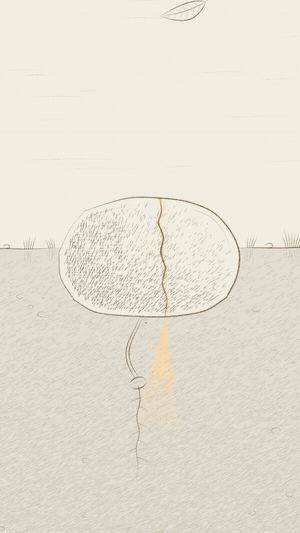
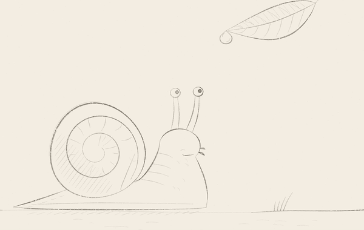

# redesign

## Qo'lda chizilgandek animatsiya

[`alesha-pro/tools`](https://github.com/alesha-pro/tools/tree/main/skills/hand-drawn-canvas-animation)
repozitoriyasidagi `hand-drawn-canvas-animation` skill'i
[`.claude/skills/hand-drawn-canvas-animation/`](.claude/skills/hand-drawn-canvas-animation/)
papkasiga o'rnatilgan (MIT litsenziyasi, manba commit `98450c6`). Claude Code
bu repozitoriyada ishlaganda skill'ni avtomatik taniydi. Masalan, shunday
so'rash kifoya: *"10 soniyalik qalam uslubidagi film: mushuk kapalakni
quvlaydi"*.

Skill Canvas 2D va JavaScript yordamida film yaratadi. Headless Chrome
kadrlarni chizadi, ffmpeg esa ularni MP4'ga yig'adi. Blender, WebGL yoki
video modeli kerak emas. Beshta ko'rinish bor: ink, pencil, riso, screen va
doodle (foto ustida chizish). Shuningdek uchta dvigatel mavjud: found motion
(rotoskop), sand (qum animatsiyasi) va paper3d (pop-up kitob).

### Asosiy qoidalar (skill'dan o'rganilgani)

- **Butun pozalar.** Personaj aylanadigan bo'laklardan yig'ilmaydi. Har bir
  kalit poza to'liq qayta chiziladi, oraliq kadrlar (`inbetweenCel`) faqat
  mos keluvchi chiziqlar orasida quriladi.
- **Exposure sheet.** Har bir harakat uchun birtadan, ikkitadan yoki ushlab
  turish tanlanadi (24 fps). Tez harakat birtadan, sekin harakat ikkitadan.
- **Barqaror chiziqlar.** Tasodifiylik faqat seed orqali olinadi
  (`Math.random` ishlatilmaydi). Chizma ushlab turilganda uning chiziqlari
  ham qimirlamaydi, "boil" faqat ataylab qo'llanadi.
- **Kontakt va vazn.** Oyoq yerda turadi, tayyorgarlik (anticipation),
  zarba va tiklanish aniq kadrlarga rejalashtiriladi.
- **Tekshiruv.** Avval `--grid`, keyin `--strip` va `--only`, oxirida to'liq
  MP4. Faqat kontakt varag'ining o'zi harakatni tekshirishga yetmaydi.

### Filmlar

- [`films/pf174-bojxona/`](films/pf174-bojxona/) — **"Bojxona islohoti:
  PF-174 sodda tilda"**. Prezidentning 2026-yil 27-avgustdagi PF-174-son
  bojxona farmoni bo'yicha 6 qismli vertikal tushuntirish seriyasi va
  12:51 lik bitta yaxlit film: maqsadlar va strategiya,
  tadbirkorlarga yengilliklar, bojxona qiymati va hujjatlar, fuqarolar va
  to'lovlar, inson omilisiz bojxona, raqamli markaz va ijro nazorati.
  Burchakda **shopo** logotipi, sintez qilingan fon musiqasi va effektlar,
  diktor uchun vaqtga moslangan matn.
- [`films/kitob-reklama/`](films/kitob-reklama/) — **"Ishonmang, lekin
  bajarib ko‘ring!"** kitobi reklamasi (Dilshod Mannopov). 36 soniyalik
  vertikal video: kitobdagi limon tajribasi tomoshabin bilan birga o'tkaziladi,
  oxirida muqova chiqadi.
- [`films/pochtam-reklama/`](films/pochtam-reklama/) — **Pochtam
  (pochtam.uz) uchun reklama**. 54 soniyalik vertikal video, ilovaning
  haqiqiy ekranlarida 5 qadam: do'konni topish → skrinshot yuklash → jami
  narx → qo'llanma → buyurtma va kuzatish. Oxirida brend introsi.
- [`films/tosh-teshar/`](films/tosh-teshar/) — **"Tomchi tomib, tosh
  teshar"**. 38 soniyalik vertikal (9:16) motivatsion film: tomchilar toshni
  yoradi, tosh ostidagi urug' nurga yo'l topib, lola bo'lib ochiladi. Qalam
  dunyosi nur bilan rangga kiradi.
- [`films/tomchi/`](films/tomchi/) — 8 soniyalik qalam etyudi: shilliqqurt va
  shudring tomchisi.

