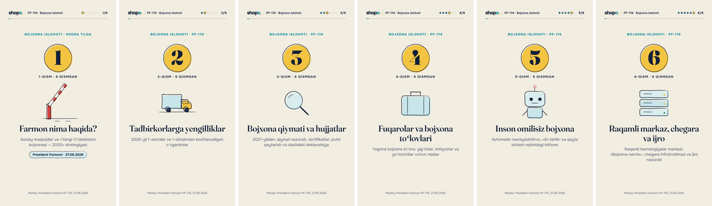

# Bojxona islohoti: PF-174 sodda tilda (6 qismli video seriya)

O'zbekiston Respublikasi Prezidentining 2026-yil 27-avgustdagi **PF-174-son
Farmoni** ("Davlat bojxona xizmati organlari faoliyatini takomillashtirish va
bojxona ma'murchiligida zamonaviy yondashuvlarni joriy etish chora-tadbirlari
to'g'risida") bo'yicha batafsil tushuntirish videolari. Vertikal format
(9:16, 1080×1920), Reels, Telegram, TikTok va YouTube Shorts uchun.

Seriya 6 qismdan iborat. Har bir qism alohida ko'rilsa ham tushunarli, oxirida
keyingi qism e'lon qilinadi. Bundan tashqari, seriya **bitta yaxlit filmga**
(12:51) ham birlashtirilgan.



## Qismlar

| Qism | Fayl | Davomiyligi | Mazmuni |
| --- | --- | --- | --- |
| 1 | [`out/qism-1-final.mp4`](out/qism-1-final.mp4) | 2:41 | **Farmon nima haqida?** Hujjat (7 bo'lim, 21 band, 3 ilova); «Intellektual bojxona» g'oyasi; 2030-yilgacha maqsadlar: 60% inson omilisiz, tushumlar YaIMning 4,4%, vaqt 2 barobar kam (importda 2 soat, eksportda 30 daqiqa); strategiyaning 5 yo'nalishi; joriy holat (79% / 10% / 11% yo'laklar, 76,2 trln so'm, LPI'da 140 → 74-o'rin); saqlanib qolgan muammolar |
| 2 | [`out/qism-2-final.mp4`](out/qism-2-final.mp4) | 2:20 | **Tadbirkorlarga yengilliklar.** 2026-yil 1-sentabrdan bekor qilinadigan 5 talab; 1-oktabrdan QQSni o'zaro hisobga olish va eksport yig'imlari −30%; keyingi qadamlar (mobil ilova, bank foizlari, «Feedback», 120 kunlik bo'lib to'lash, «Customs Open Dialogue») |
| 3 | [`out/qism-3-final.mp4`](out/qism-3-final.mp4) | 2:05 | **Bojxona qiymati va hujjatlar (2027).** Qiymat nazoratidagi 4 o'zgarish; soliq va bojxona tekshiruvlari birgalikda; kelib chiqish sertifikati (kichik tafovutlar, 1 va 3 yil); pulni qaytarish, reeksport, ekologik sertifikat, VIO jarimalari; dastlabki deklaratsiyaning yangi tartibi |
| 4 | [`out/qism-4-final.mp4`](out/qism-4-final.mp4) | 1:52 | **Fuqarolar va bojxona to'lovlari.** Yagona bojxona to'lovi: 20%, lekin 1 kg uchun kamida $2 (ikki hisob namunasi bilan); kichik to'lovda yig'im olinmasligi; boj imtiyozlari (2029-yil 1-yanvar); yo'lovchilar uchun rejalar (10 ming $, SI robotlar, «Customs fine») |
| 5 | [`out/qism-5-final.mp4`](out/qism-5-final.mp4) | 2:20 | **Inson omilisiz bojxona.** 10% → 60%; avtomatik rasmiylashtiruvning 4 sharti; erkin savdo hamkorlari; «AI-tahlil» (2028); qayta ishlash rejimidagi intizom; strategiyadagi raqamli vositalar |
| 6 | [`out/qism-6-final.mp4`](out/qism-6-final.mp4) | 2:33 | **Raqamli markaz, chegara va ijro.** Raqamli texnologiyalar markazi va uning moliyalashtirilishi; «Bojxona-servis» MChJ va «Safe Customs»; Xonobod, Ayritom, S. Najimov postlari yonidagi maydonlar; strategiya byudjeti (1,7 trln so'm); ijro nazorati; xulosa |
| **Yaxlit film** | [`out/pf174-toliq-final.mp4`](out/pf174-toliq-final.mp4) | 12:51 | Olti qism bitta filmda: boshida bitta kirish, qism muqovalari bob kartasiga aylangan, orada "Keyingi qism" kartalari yo'q, musiqa uzluksiz, oxirida bitta "Rahmat!" kartasi ([`pf174-toliq.html`](pf174-toliq.html)) |

Har bir sahnaning oxirgi holati: `out/qism-N-scenes.jpg` (masalan,
[1-qism](out/qism-1-scenes.jpg)).

## Qanday ko'rinadi

- **Qog'oz va siyoh.** Kartalar, ikonkalar, strelkalar va muhrlar qo'lda
  chizilgandek ko'rinadi. Chiziq ekranda chizib chiqiladi, keyin qimirlamay
  turadi (skill qoidasi: ushlab turilgan chizma o'z izini saqlaydi).
- **Muhim so'zlar** qalinroq yoziladi va ustidan sariq marker o'tadi.
  Kuchga kirish sanasi sariq kalendar yorlig'ida ko'rsatiladi.
- **Raqamlar** sanab chiqiladi (60%, 4,4%, 76,2 …). Bekor qilingan talablarga
  qizil **BEKOR** muhri bosiladi, avtomatik rasmiylashtiruv shartlari birma-bir
  belgilanadi, eksport yig'imlari chiziqlari 100 dan 70 ga qisqaradi.
- **Tepada**, chap burchakda **shopo** logotipi, yonida "PF-174 · Bojxona
  islohoti", o'ngda qism raqami (N/6) va qism ichidagi jarayon chizig'i.
  **Pastda:** "Manba: Prezident Farmoni PF-174, 27.08.2026".
- **Vaqt matnga qarab hisoblanadi:** har bir karta taxminan har so'z uchun
  0,32 soniya, qo'shimcha animatsiya vaqti bilan ekranda turadi. Shuning uchun
  matn o'qib ulguradigan tezlikda almashadi.

## Logotip


Minimal yozuvli belgi: kichik harflar bilan **shopo**, oxirgi "o" firuza
rangda, yonida sariq nuqta. Shrift Onest ExtraBold. Videoda har bir kadrning
chap yuqori burchagida turadi. Alohida fayllar (shaffof fon, 1306×540):
[`brand/shopo-logo.png`](brand/shopo-logo.png) (och fon uchun) va
[`brand/shopo-logo-light.png`](brand/shopo-logo-light.png) (to'q fon uchun).
Kodi `series.js` dagi `logo()` funksiyasi, fayllarni
`node tools/logo.mjs` yaratadi.

## Ovoz

Hamma tovush [`sound.js`](sound.js) da Web Audio yordamida sintez qilingan.
Tayyor namunalar yoki litsenziyali musiqa ishlatilmagan, shuning uchun
mualliflik huquqi masalasi yo'q.

- **Faqat musiqiy (balandligi bor) tovushlar.** Shovqindan yasalgan tovushlar
  yo'q: hi-hat, barmoq chertishi, "shamol", muhrdagi shitirlash olib
  tashlangan. Ular telefon karnayida shitirlash bo'lib eshitilardi. 5 kHz
  dan yuqori energiya umumiy ovozga nisbatan taxminan 17 dB kamaydi.
- **Fon musiqasi** past ovozda (oldingidan taxminan 16 dB past). Tonallik
  C-major, daqiqasiga 100 zarb, akkordlar Cadd9 – G/B – Am7 – Fmaj7.
  Yumshoq pad, bas, aks-sadoli arpedjio, qo'ng'iroqcha, 1- va 3-zarbda yumshoq
  "kick", 2- va 4-zarbda yog'och "tap". Muqova va bob kartalarida ritm
  to'xtaydi. Oxirgi kartada akkord so'nib boradi.
- **Effektlar** musiqa bilan bir tonallikda:
  - karta chiqqanda — yog'och "marimba" notasi;
  - belgi qo'yilganda — ikki notali qo'ng'iroq;
  - raqam sanalganda — ko'tariluvchi arpedjio va jiringlash;
  - muhr bosilganda — yumshoq "gup" va yog'och taqillash;
  - sahna almashganda — uch notali arfa;
  - muqovada — arfa va qo'ng'iroq akkordi.
- **Balandlik:** ovoz eng baland nuqtasi −1,5 dBFS bo'ladigan qilib
  ko'tarilgan, kuchli cheklagich ishlatilmagan (u ham shitirlashga sabab
  bo'lardi). Musiqa effektlardan taxminan 15 dB past.
- **Faqat ovozni render qilish:** `node tools/score.mjs 1 out/sinov.wav`
  (kadrlarsiz). `music` yoki `fx` qo'shilsa, faqat musiqa yoki faqat
  effektlar chiqadi.
- **Uzun film ovozi:** `--chunks 90` bilan bo'laklab parallel hisoblanadi.
  Har bir bo'lak 4 soniya oldindan boshlanadi va 50 ms lik o'tish bilan
  ulanadi. Ulanish joylarida farq 16 bitli ovozning 1 qadami darajasida.

## Mazmunga oid eslatmalar

- Matnlar farmonning o'zidan olingan: I–VII bo'limlar, 1-ilova
  (strategiya), 2-ilova (56 bandli yo'l xaritasi). Joriy holat raqamlari
  strategiyaning "Joriy holat tahlili" bobidan.
- **Farmonda belgilangan** o'zgarishlar sana bilan beriladi. **Yo'l
  xaritasi va strategiyadagi** tadbirlar (qonun loyihalari, 10 ming $
  me'yori, robotlar, «Customs fine» va boshqalar) videoda "reja", "qonun
  loyihasi" yoki "strategiya" deb alohida belgilangan.
- 4-qismdagi yagona bojxona to'lovi misollari ($300 / 5 kg va $40 / 8 kg)
  faqat "20%, lekin 1 kg uchun kamida $2" qoidasini tushuntirish uchun
  tanlangan. Hisob: ikki summadan kattasi.
- Davlat ramzlari, gerb yoki idoralar logotiplari ishlatilmagan. Hamma rasmlar
  shu seriya uchun chizilgan umumiy ikonkalar.
- Har bir qism oxirida: *"Video farmon mazmunini soddalashtirib tushuntiradi,
  huquqiy maslahat emas. Rasmiy matn: lex.uz."*

## Diktor ovozi uchun matn

[`diktor-matni.md`](diktor-matni.md) — 50 sahnaning har biri uchun o'qiladigan
matn (jami 1227 so'z, daqiqasiga ~114 so'z sur'atida taxminan 10:45). Har bir
sahnada ovoz qo'yiladigan vaqt oralig'i (alohida qismda va 12:51 lik yaxlit
filmda), so'z soni va shu oraliqqa sig'ishi ko'rsatilgan. Matn mavjud
sahnalarga moslab yozilgan, videoni qayta montaj qilish shart emas.

Raqamlar so'z bilan yozilgan, talaffuz jadvali va yozib olish talablari
(har sahna alohida fayl, `qism-1-03.wav`) shu faylning boshida.

Matnning o'zi [`diktor-vo.mjs`](diktor-vo.mjs) faylida. Uni o'zgartirgach,
`node tools/diktor.mjs` vaqtlar va sig'ish tekshiruvini yangilaydi.

## Fayllar

- [`series.js`](series.js) — dvigatel: ranglar, logotip, qo'lda chizilgan
  ikonkalar, karta turlari (`text`, `item`, `stat`, `check`, `step`, `tl`,
  `bars`, `lanes`, `formula`, `example`, `compare`, `clocks`, `years`,
  `pins`, `merge`, `progress` …), matnni joylash va vaqt
- [`sound.js`](sound.js) — fon musiqasi va effektlar (sintez)
- [`parts.js`](parts.js) — 6 qismning ssenariysi (faqat ma'lumot). Matnni
  shu yerda o'zgartirsangiz, joylashuv, vaqt va ovoz o'zi moslashadi
- [`qism-1.html`](qism-1.html) … [`qism-6.html`](qism-6.html) — har bir
  qismning kirish fayli
- [`fonts.js`](fonts.js) — Onest va Fraunces shriftlari (SIL OFL 1.1),
  oflayn render uchun ichiga joylangan
- [`tools/check.mjs`](tools/check.mjs) — har bir qismning sahna vaqtlari va
  joylashuvi (xavfsiz hududdan chiqib ketgan karta bo'lsa, ogohlantiradi)
- [`tools/shots.mjs`](tools/shots.mjs) — tanlangan lahzalar yoki har bir
  sahna oxiridan ko'rik varag'i
- [`pf174-toliq.html`](pf174-toliq.html) — yaxlit film (`PF.film('all')`);
  [`tools/render-long.mjs`](tools/render-long.mjs) — uni parallel render qilish
- [`tools/score.mjs`](tools/score.mjs) — faqat ovozni render qilish;
  [`tools/logo.mjs`](tools/logo.mjs) — logotip PNG fayllari
- [`diktor-vo.mjs`](diktor-vo.mjs), [`tools/diktor.mjs`](tools/diktor.mjs) —
  diktor matni va undan [`diktor-matni.md`](diktor-matni.md) ni yig'uvchi
  skript

```bash
cd films/pf174-bojxona
npm i --no-audit --no-fund
node tools/check.mjs                       # vaqtlar va joylashuv
node tools/shots.mjs 2 out scenes          # 2-qism sahnalari varag'i
node render.mjs qism-2.html --out out      # 2-qism: MP4 + ovoz
```

Yaxlit film ko'p kadrli, shuning uchun uni 4 ta parallel sahifada render
qilish qulay:

```bash
node tools/render-long.mjs pf174-toliq.html out 4                    # kadrlar → out/pf174-toliq.mp4
node tools/score.mjs pf174-toliq.html out/pf174-toliq-score.wav --chunks 90
```

Oxirida ovoz eng baland nuqtasi −1,5 dBFS bo'ladigan qilib ko'tariladi va
videoga ulanadi (har bir qism va yaxlit film uchun):

```bash
cd out
for n in qism-1 qism-2 qism-3 qism-4 qism-5 qism-6 pf174-toliq; do
  d=$(python3 -c "import json;print(json.load(open('$n-render.json'))['duration'])")
  mv=$(ffmpeg -i $n-score.wav -af volumedetect -f null - 2>&1 | grep max_volume | awk '{print $5}')
  g=$(python3 -c "print(round(-1.5 - ($mv), 2))")
  ffmpeg -y -i $n.mp4 -i $n-score.wav -map 0:v:0 -map 1:a:0 \
    -af "volume=${g}dB,alimiter=limit=0.891:attack=5:release=80:level=disabled,apad" \
    -t $d -c:v copy -c:a aac -b:a 192k $n-final.mp4
done
```

## Tekshiruv va cheklovlar

- 7 ta MP4 ham xatosiz dekodlanadi (1080×1920, 24 fps, H.264 + AAC).
  Qismlar kadrlari: 3881, 3363, 3016, 2694, 3372, 3691. Yaxlit film
  18 508 kadr, 12:51, ovoz ham 12:51.
- Ovoz: eng baland nuqta (true peak) −1,4 … −1,7 dBFS, umumiy balandlik
  −22 … −26 LUFS (musiqa past, effektlar siyrak bo'lgani uchun). Yaxlit film
  ovozining 8 ta bo'lak ulanish joyida sakrash yo'q.
- `tools/check.mjs`: hech bir sahna xavfsiz hududdan chiqmadi, hech birini
  kichraytirishga to'g'ri kelmadi.
- Har bir qismning oxirgi kadrlari piksel darajasida solishtirildi: faqat
  tepadagi jarayon chizig'i o'zgaradi, qolgani joyida turadi.
- Sahna varaqlari va muhr, raqam, birlashish animatsiyalarining oraliq
  kadrlari ko'zdan kechirildi. Bu muhitda videoni odatiy tezlikda ko'rish va
  ovozni eshitish imkoni bo'lmadi.
- Seriya farmonning asosiy qismini qamraydi. 3-ilova (boshqa hujjatlarga
  o'zgartirishlar) va yo'l xaritasining 56 bandidan ko'pchiligi videoga
  kiritilmagan. To'liq va rasmiy matn: lex.uz.
