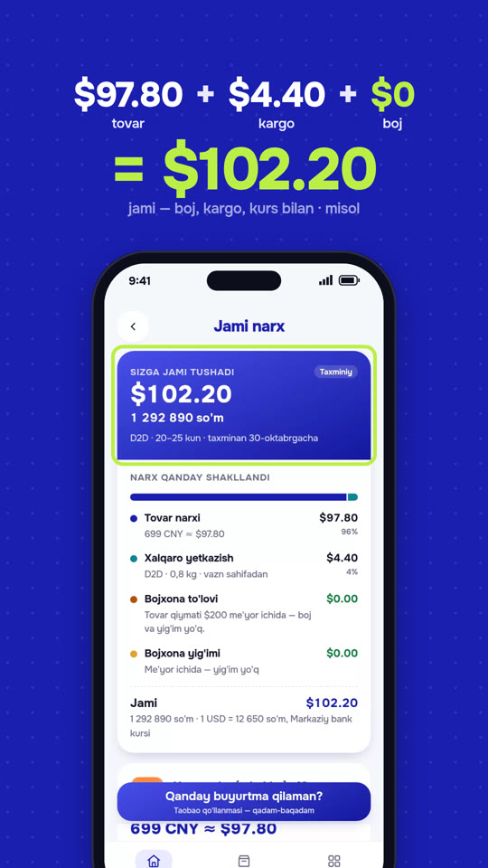

# Pochtam — promo (44,5 s, diktor ovozi uchun)

[pochtam.uz](https://pochtam.uz) uchun noldan qayta ishlangan vertikal (9:16)
promo. Reels, TikTok va Telegram uchun mo'ljallangan. Video birinchi
kadrdanoq savol bilan boshlanadi: *"Xitoyda shu narxda. Uyingizgacha qanchaga
tushadi?"* Video "Taxmin qiling!" viktorinasi bilan boshlanadi: A/B/C
javoblar va 3-2-1 sanog'i chiqadi, to'g'ri javob esa 17,5 soniyada ochiladi.
Keyin har sahnada bitta imkoniyat ko'rsatiladi. Sahnalar 2–5
soniya turadi, diktor o'z satrini aytib ulguradi. Diktor matni ElevenLabs
uchun yozilgan.



- Video (vaqtinchalik musiqa bilan, diktorsiz): [`out/pochtam-promo-final.mp4`](out/pochtam-promo-final.mp4)
- Ovozsiz nusxa (diktor va musiqa qo'yish uchun): [`out/pochtam-promo-silent.mp4`](out/pochtam-promo-silent.mp4)
- **Diktor matni, ElevenLabs uchun: [`VOICEOVER.md`](VOICEOVER.md)**, vaqt belgilari: [`out/pochtam-promo-voiceover.srt`](out/pochtam-promo-voiceover.srt)
- Musiqa uchun prompt, soniyama-soniya: [`MUSIC-PROMPT.md`](MUSIC-PROMPT.md)
- Vaqtinchalik musiqa (namuna): [`out/pochtam-promo-score.mp3`](out/pochtam-promo-score.mp3)
- Kadrlar varag'i: [`out/pochtam-promo-contact.jpg`](out/pochtam-promo-contact.jpg)

Oldingi versiyalar git tarixida saqlangan:
- 30 soniyalik versiya. Juda tez kesilgan edi, kadrlar har 0,25–2 s da almashardi.
- 66 soniyalik versiya. Diktor uchun juda uzun bo'lgan edi.

## Ketma-ketlik

Montaj 120 BPM to'rida: har kesim zarbga tushadi, logotip va ikkinchi drop
takt boshida (8 va 38 s). Imkoniyat sahnalari bir-biriga salat rangli
chiziq bilan "surilib" o'tadi.

| Vaqt | Ekranda | Diktor |
| --- | --- | --- |
| 0–2 s | **Hook:** "Taxmin qiling!" yozuvi, krossovka va ¥699, "Xitoyda shu narxda" | Taxmin qiling! |
| 2–6 s | **"Uyingizgacha qanchaga tushadi?"**, javoblar **A $98 · B $102 · C $150**, soat **3 · 2 · 1** | Uyingizgacha qanchaga tushadi? (Uch… ikki… bir…) |
| 6–8 s | **"Javob — bitta skrinshotda"**, telefon ko'tariladi, oq chaqnash | Javob — bitta skrinshotda. |
| 8–10 s | Logotip introsi | Bu — Pochtam. |
| 10–14 s | **Rasmini yuklang**: bosish → skan → topilgan do'konlar | Rasmini yuklang — sun'iy intellekt tovarni topadi. |
| 14–19 s | **Skrinshot oling** → hisob ko'z oldida quriladi: **$97.80 + $4.40 + $0 = $102.20** (misol), viktorinaning javobi **B ✓** | Narxni skrinshot qiling — jami summa boj, kargo va kurs bilan tayyor. |
| 19–22 s | **Boj: $0**, oyiga $200 gacha, **BOJSIZ** muhri | Oyiga ikki yuz dollargacha — bojsiz. |
| 22–25 s | **Butun savat?** — do'kon savati telefonda, uchta tovar belgilanadi, skrinshot → **Bitta skrinshot — bitta hisob**: chek chiqadi (tovarlar $99.99 + kargo $18.00 + boj $0 = **$117.99**, misol) | Butun savatni ham — bitta skrinshotda. |
| 25–28,5 s | **Eng arzon kuryer** → **Kuryer siz uchun sotib oladi**, "Xabar tayyor ✓" | Eng arzon kuryer — u siz uchun sotib oladi. |
| 28,5–32 s | **Qadam-baqadam qo'llanma** → **Jo'natmani kuzating** | Qo'llanma va jo'natmani kuzatish. |
| 32–35 s | **43** do'kon · **20** kuryer · **3 til** (raqamlar sanaladi) | Qirq uch do'kon. Yigirma kuryer. Uch til. |
| 35–38 s | **"Hammasi — bitta ilovada"** | Hammasi — bitta ilovada. |
| 38–41 s | Quti eshik oldiga tushadi, konfetti: **"Orzuingiz — eshigingiz oldida."** | Orzuingiz — eshigingiz oldida. |
| 41–44,5 s | Logotip va **pochtam.uz** (42,5 s) | Hoziroq sinab ko'ring — Pochtam nuqta uz. |

## Qanday ishlangan

- **Ekranlar ilovaning hozirgi holatidan olingan.** Ilova repozitoriyi
  (`NShakhobiddin/Pochtachi`, 2026-yil 5-oktabr, `d1fbbaf`) lokal serverda
  ochilib, telefon o'lchamida (390×844, 2x) Chromium'da ichidan o'tildi
  ([`tools/capture-v2.mjs`](tools/capture-v2.mjs)). Tarmoqqa chiqish yo'q edi:
  AI va Markaziy bank kurslari javoblari ilovaning smoke-testi uslubida
  soxta javob (mock) bilan berildi. Jonli Worker'ga ham, AI'ga ham so'rov
  ketmagan.
- **Yuklangan sahifalar** — umumiy, brendsiz do'kon va savat sahifalari
  ([`tools/demo-store-page.html`](tools/demo-store-page.html),
  [`tools/demo-cart-page.html`](tools/demo-cart-page.html)). Ularni
  [`tools/render-pages.mjs`](tools/render-pages.mjs) rasmga aylantiradi.
- **Raqamlar** ilovaning o'z formulalari bilan hisoblangan. Kurs sinov
  qiymati (1 USD = 12 650 so'm), shuning uchun jami summalar ekranda
  "misol" deb belgilangan. 43 do'kon, 20 kuryer, 7 qo'llanma va oyiga $200
  gacha bojsiz qoidasi ilova ma'lumotlaridan tekshirildi.
- Ekranlar WebP holida [`screens.js`](screens.js) ga joylangan
  ([`tools/embed.mjs`](tools/embed.mjs)). Brend shrifti Onest, logotip
  bo'laklari [`brand-assets.js`](brand-assets.js) da.
- **Ko'rinish** — Pochtam ranglari (ko'k #1A1FB0, salat #bbef45, to'q
  ko'k, och binafsha). Katta harakatli yozuvlar, butun kadrni egallagan rangli
  fonlar, telefon ichida haqiqiy ekranlar (status-bar bilan). Kamera telefonga
  yaqinlashadi, bosishlar to'lqin bilan, muhim joylar salat ramka bilan
  ko'rsatiladi. Skrinshot paytida viewfinder burchaklari va oq chaqnash
  chiqadi, zarbalarda kadr bir oz silkinadi.
- **Ovoz.** Video diktor ([`VOICEOVER.md`](VOICEOVER.md)) va tashqi trek
  ([`MUSIC-PROMPT.md`](MUSIC-PROMPT.md)) uchun kesilgan. Ichidagi
  vaqtinchalik musiqa xuddi shu to'rda Web Audio bilan sintez qilingan va
  faqat ohangli tovushlardan iborat: F#m–D–A–E akkordlari, 120 BPM,
  logotip zarbasi, ikkinchi drop va final.

## Tayyor musiqani joylash

[`tools/fit-music.py`](tools/fit-music.py) 120 BPM dagi tayyor trekni videoga
moslaydi. Trek butun taktlar (2 s) bo'yicha qayta yig'iladi:
- video hook zarbasidan boshlanadi;
- beat 8 s dagi logotipga, pastlash 34 s ga, naqarot 38 s dagi qutiga tushadi;
- trekning oxirgi ikki zarbasi logotip (41 s) va manzil (43 s) bilan birga keladi.

Ulanish joylarida 30 ms li yumshoq o'tish bor, u keyingi taktning zarbasidan
oldin tugaydi. Taktlar boshi sukut bo'yicha 0,178 s; boshqa trek uchun
`--offset` bilan beriladi.

Suno'dagi "Cold-Open Hit" treki shu usulda joylandi. Taktlar boshi beat
tahlili bilan topildi. Natijada 1068 kadr, 44,5 s, −14,0 LUFS, eng baland
nuqta −1,4 dBFS. Trek foydalanuvchiniki, shuning uchun u ham, u qo'yilgan
video (`out/pochtam-promo-music.mp4`) ham ochiq repozitoriyga qo'yilmagan.

Namuna musiqadan Suno'da yaratilgan cover trek ("pochtam-promo-score")
tuzilmani saqladi, lekin 121,6 BPM da chiqdi. U 120 BPM ga cho'zildi (ohang
balandligi o'zgarmaydi) va uch bo'lakda joylandi:
- beat 8 s ga tushishi uchun 0,35 s kech boshlanadi;
- qaytish 38 s ga tushishi uchun tinch pastlash ichida 60 ms ga suriladi;
- trekning katta yakuniy zarbasi 41 s dagi logotipga qo'yiladi.

Zarbalar butun trek davomida video to'ridan ±25 ms ichida. Buyruq:
`--bpm 121.6 --edl "0.35,35.6,0;35.6,40.96,35.19;40.96,44.5,42.52"`.

```bash
python3 tools/fit-music.py trek.mp3 /tmp/fitted.wav
ffmpeg -i out/pochtam-promo-silent.mp4 -i /tmp/fitted.wav -map 0:v -map 1:a \
  -af loudnorm=I=-14:TP=-1:LRA=11 -c:v copy -c:a aac -b:a 192k -t 44.5 out/pochtam-promo-music.mp4
```

## Tayyor diktor ovozini joylash

[`tools/place-voice.py`](tools/place-voice.py) bitta yozuvda o'qilgan diktor
ovozini (ElevenLabs) pauzalari bo'yicha 22 bo'lakka ajratadi. Har bir bo'lak
videodagi o'z lahzasiga qo'yiladi:
- "Uyingizgacha…" — 2 s da;
- "uch · ikki · bir" — 4,5 · 5 · 5,55 s da;
- "Pochtam!" — logotip bilan;
- raqamlar — har bir hisoblagichga;
- "Pochtam nuqta uz" — 42,55 s da.

Musiqa 2 dB past turadi va diktor gapirganda yana 8 dB pasayadi. Natijada
ovoz musiqadan ~10,7 dB baland. Shu yo'l bilan foydalanuvchining Bekzod
ovozidagi yozuvi joylandi: −14,1 LUFS, eng baland nuqta −1,4 dBFS. Ovoz ham,
video (`out/pochtam-promo-voice.mp4`) ham ochiq repozitoriyga qo'yilmagan.

```bash
python3 tools/place-voice.py diktor.mp3 /tmp/fitted.wav /tmp/mix.wav
ffmpeg -i out/pochtam-promo-silent.mp4 -i /tmp/mix.wav -map 0:v -map 1:a \
  -af loudnorm=I=-14:TP=-1:LRA=11 -c:v copy -c:a aac -b:a 192k -t 44.5 out/pochtam-promo-voice.mp4
```

## Fayllar va buyruqlar

```bash
cd films/pochtam-promo
npm i --no-audit --no-fund
# 1) yuklanadigan sahifalar va ekranlar (Pochtachi checkout'ida, playwright bilan)
node tools/render-pages.mjs /tmp/pp
cp tools/capture-v2.mjs <Pochtachi>/.capture-promo.mjs && (cd <Pochtachi> && node .capture-promo.mjs /tmp/cap /tmp/pp)
node tools/embed.mjs /tmp/cap /tmp/pp
# 2) render, ovoz balandligi, ovozsiz nusxa
node render.mjs pochtam-promo.html --out out
cd out && ffmpeg -y -i pochtam-promo.mp4 -i pochtam-promo-score.wav -map 0:v:0 -map 1:a:0 \
  -af "volume=3.1dB,alimiter=limit=0.891:attack=5:release=80:level=disabled,apad" -t 44.5 \
  -c:v copy -c:a aac -b:a 192k -movflags +faststart pochtam-promo-final.mp4
ffmpeg -y -i pochtam-promo.mp4 -c:v copy -an -movflags +faststart pochtam-promo-silent.mp4
```

## Tekshiruv va cheklovlar

- MP4 xatosiz dekodlanadi: 1068 kadr, 44,5 s, 1080×1920, 24 fps, ovoz AAC
  48 kHz. Vaqtinchalik musiqa −10,8 LUFS, eng baland nuqta −1,5 dBFS.
  6 kHz dan yuqorida energiya deyarli yo'q (−67,8 dB), ya'ni shovqin yo'q.
- Grid va to'liq o'lchamdagi kadrlar ko'zdan kechirildi: telefon ichidagi
  ekranlar kesilmaydi, sarlavhalar telefon ostida qolmaydi.
- Diktor satrlarining uzunligi taxminan hisoblangan (sekundiga ~5 bo'g'in).
  Haqiqiy uzunlik tanlangan ovoz va tezlikka bog'liq. Har satr oynasida
  0,1–1,4 s zaxira bor.
- Bu muhitdan pochtam.uz ning o'ziga kirib bo'lmadi. Shuning uchun ekranlar
  repozitoriydagi kod bilan lokal serverda olindi.
- Videoni odatiy tezlikda ko'rish va ovozni eshitish imkoni bo'lmadi.
