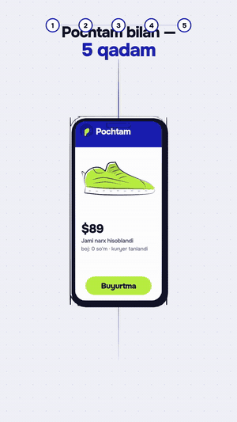

# Pochtam — 5 qadamda chet eldan xarid (reklama video, v2)

[pochtam.uz](https://pochtam.uz) uchun 54 soniyalik vertikal (9:16)
reklama-tushuntirish videosi. Instagram Reels, Telegram va TikTok uchun.
Video ilovadan qanday foydalanishni xaridor bosadigan tartibda, **ilovaning
haqiqiy ekranlarida** ko'rsatadi.



## Ketma-ketlik

| Vaqt | Sahna | Ekranda (haqiqiy ilova) | Nima ko'rsatiladi |
| --- | --- | --- | --- |
| 0–6 s | **Muammo** (qalam) | chizilgan do'kon sahifasi | *"Chet eldan xarid qilmoqchimisiz?"*; atrofda "Qaysi do'kon? Qaysi kuryer? Boj qancha? Jami necha pul? Qachon keladi?" pufakchalari va chalkash chiziq |
| 6–8.9 s | **Pochtam** | — | Yashil p ilova introsidagidek tushadi, dunyo brend ranglariga kiradi: *"Pochtam bilan — 5 qadam"*, 5 nuqta paydo bo'ladi |
| 8.9 s | **1. Do'konni toping** | Do'konlar → Pochtam AI | Turlar bo'yicha 43 do'kon; "erkaklar krossovkasi 42" deb yozilganda AI Taobao, Poizon va Amazon'ni tavsiya qiladi |
| 15.2 s | **2. Skrinshot yuklang** | do'kon sahifasi → Boshlash → skaner | Narx halqaga olinadi, "chik" — skrinshot olinadi. Keyin "Topdim — qanchaga tushadi?" bosiladi va "AI narxni o'qiyapti…" |
| 21.5 s | **3. Jami narxni biling** | Jami narx | "Sizga jami tushadi $102.20 · 1 292 890 so'm", keyin narx tarkibi: tovar, kargo, boj va yig'im (me'yor ichida — 0) |
| 27.8 s | **4. Qo'llanmani oching** | "Qanday buyurtma qilaman?" → Taobao qo'llanmasi | Qo'llanmaning 11 qadami ekran ostida birin-ketin o'tadi: kuryer va ID → ro'yxatdan o'tish → … → qabul qilish |
| 34.1 s | **5. Buyurtma bering** | Kuryer siz uchun sotib oladi → Xaridlarim | "Yozish" bosilganda kuryerga tayyor xabar ketadi. Xaridlarim'da "Buyurtma qildim" bosiladi, holat "Yo'lda"ga o'tadi |
| 40.4 s | **Ilovada yana** | Ma'lumotnoma | Do'konlar, Kuryerlar, Bojxona, Qo'llanmalar, Pochtam AI, Mutaxassis yordami, Sozlamalar; *O'zbekcha · Ўзбекча · Русский* |
| 43.6 s | **Natija** | — | Quti eshik oldiga tushadi, ochiladi: *"Orzuingiz — eshigingiz oldida."* |
| 47.4 s | **Brend** | — | Ilovaning haqiqiy logotip introsi, **pochtam.uz**, *"Orzu qiling — qolganini biz hal qilamiz"* |

Tepada 5 nuqtali chiziq tomoshabinga qaysi qadamda turganini doim ko'rsatib
turadi. Muhim tugma va raqamlar qo'lda chizilgan salat rangli halqa bilan
belgilanadi, bosish joyi to'lqin bilan ko'rsatiladi, izohlar yorliqlarda.

## 30 soniyalik qisqa versiya

[`pochtam-reklama-30.html`](pochtam-reklama-30.html) →
[`out/pochtam-reklama-30-final.mp4`](out/pochtam-reklama-30-final.mp4)
(720 kadr, 30,0 s, 1080×1920, ovozli). Chizmalar, ekranlar va brend introsi
uzun versiya bilan bir xil, faqat sur'at tezroq:

| Vaqt | Sahna |
| --- | --- |
| 0–4.8 s | Muammo va savollar → p tushadi → *"Pochtam bilan — 5 qadam"* |
| 4.8 / 8.5 / 12.2 / 15.9 / 19.6 s | 5 qadam, har biri 3,7 s: do'kon → skrinshot → jami narx → qo'llanma → buyurtma ("Yo'lda!") |
| 23.3 s | Quti eshik oldida: *"Orzuingiz — eshigingiz oldida."* |
| 26.3–30 s | Brend introsi va **pochtam.uz** |

Qisqa versiyada "Ilovada yana" kadri va qo'llanmaning muqova ekrani yo'q.
Beshinchi qadamda Xaridlarim darhol "Yo'lda" holatiga o'tadi.

```bash
node render.mjs pochtam-reklama-30.html --out out
```

## Haqiqiy ekranlar qanday olindi

[`tools/capture-screens.mjs`](tools/capture-screens.mjs) Pochtachi
repozitoriyasidagi ilovani lokal serverda ochadi va oqimni bosib chiqadi:
do'konlar, AI so'rovi, skrinshot yuklash, natija, qo'llanma va Xaridlarim.

- **Oflayn ishlaydi.** Tashqariga ketadigan barcha so'rovlar bloklanadi
  (o'lchov beacon'i ham). AI javoblari va valyuta kursi ilovaning o'z smoke
  testidagi soxta javoblardan olinadi. Pochtam serveriga hech narsa
  yuborilmadi, AI byudjeti sarflanmadi.
- Summalar ($102.20, 1 292 890 so'm, kargo $4.40) ilovaning o'z
  formulalari bilan hisoblangan. Kurs 1 USD = 12 650 so'm — test qiymati,
  haqiqiy kurs boshqacha bo'lishi mumkin.
- Suratga olinayotgan do'kon sahifasi
  ([`tools/demo-store-page.html`](tools/demo-store-page.html)) umumiy
  maket. U hech qaysi do'konning dizaynini takrorlamaydi.
- Ekranlar [`app-screens.js`](app-screens.js) ichida WebP data-URL
  ko'rinishida saqlangan. Muhim elementlarning koordinatalari ham shu yerda.

## Fayllar

- [`pochtam-reklama.html`](pochtam-reklama.html) — film manbasi: brief,
  vaqtlar (`T`), qadamlar (`STEPS`), izohlar (`stepAnnos`), ovoz
- [`brand-assets.js`](brand-assets.js) — logotip bo'laklari va Onest
  shrifti (lotin va kirill)
- [`out/pochtam-reklama-final.mp4`](out/pochtam-reklama-final.mp4) — ovozli video;
  [`out/pochtam-reklama-poster.jpg`](out/pochtam-reklama-poster.jpg);
  [`out/pochtam-reklama-contact.jpg`](out/pochtam-reklama-contact.jpg)

```bash
cd films/pochtam-reklama
npm i --no-audit --no-fund
node render.mjs pochtam-reklama.html --grid 48 --out out   # tezkor ko'rik
node render.mjs pochtam-reklama.html --out out             # to'liq MP4 + ovoz (~2 daqiqa)
```

## Tekshiruv va cheklovlar

- MP4 xatosiz ochiladi: 1291 kadr, 53,8 s, 1080×1920. Ovoz balandligi eng
  yuqori nuqtada -9,4 dB. Oxirgi pauzadagi kadrlar bir xil.
- Kadrlar va kontakt varag'i tekshirildi. Bu muhitda videoni odatiy
  tezlikda tomosha qilish va ovozni eshitish imkoni bo'lmadi.
- Ilova yangilansa, ekranlarni `tools/capture-screens.mjs` bilan qayta olish
  kerak. Qolgan kod o'zgarmaydi.
- Oldingi versiya (33 s, 5 bekatli yo'l) git tarixida saqlangan.
