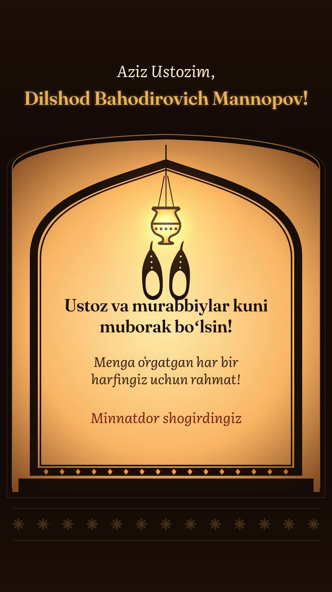

# Ustozning kavushi

**Ustoz va murabbiylar kuni** uchun uchinchi tabrik: ustoz **Dilshod
Bahodirovich Mannopov**ga. Ustoz haqidagi mashhur Sharq rivoyati asosida
yaratilgan, Sharq soya teatri uslubidagi 1 daqiqa 37 soniyalik vertikal (9:16)
film.



- Video: [`out/ustoz-rivoyat-final.mp4`](out/ustoz-rivoyat-final.mp4) (1080×1920, 24 fps, ovozli)
- Kadrlar varag'i: [`out/ustoz-rivoyat-contact.jpg`](out/ustoz-rivoyat-contact.jpg)

## Rivoyat

Manba: al-Xatib al-Bag'dodiy, «Tarixi Bag'dod», tilshunos olim al-Farro
(Yahyo ibn Ziyod) haqidagi bob. Rivoyatning Horun ar-Rashid va Imom Kisoiy
nomlari bilan aytiladigan varianti ham bor.

Xalifa Ma'mun ikki o'g'lini buyuk olim al-Farroga ta'lim olish uchun
topshirgan edi. Bir kuni dars tugab, ustoz o'rnidan turdi. Ikki shahzoda
uning kavushini keltirish uchun birdan yugurdi va kim keltirishini talashdi.
Oxiri kelishdilar: har biri bittadan kavush keltirdi. Bu xabar Xalifaga
yetib bordi. U ustozni chorlab so'radi: "Dunyoda eng aziz inson kim?" Ustoz:
"Amirul mo'minindan azizroq kishini bilmayman." Xalifa: "Yo'q. Eng aziz inson
o'rnidan turganda, kavushini xalifaning ikki valiahdi talashib
keltiradigan kishidir." Ustoz ularni to'xtatmoqchi bo'lganini, lekin intilgan
sharaflaridan mahrum qilishdan qo'rqqanini aytdi. Xalifa javob berdi:
"To'xtatganingizda, sizni koyigan bo'lardim. Bu ish ularning qadrini
tushirmadi, aksincha yuksaltirdi. Inson qanchalik ulug' bo'lmasin, uch zotga
xizmat qilishdan ulug' emas: hukmdoriga, otasiga va ustoziga."

Film Alisher Navoiyning bayti va tabrik bilan tugaydi:

> Haq yo'lida kim senga bir harf o'qitmish ranj ila,
> Aylamak bo'lmas ado oning haqin yuz ganj ila.

## Hikoya

| Vaqt | Ekranda | Yuqori yozuv |
| --- | --- | --- |
| 0–9 s | Tungi Bag'dod: minoralar, gumbazlar, hilol oy. Kamera saroyning yoritilgan derazasiga kirib boradi | «Ustozning kavushi», Sharq rivoyati. *Qadim Bag'dod. Xalifa Ma'mun saroyi.* |
| 9–19 s | Dars: ustoz yostiqda o'tirib, kitob ustida saboq beradi, ikki shahzoda tiz cho'kib tinglaydi | *Xalifa Ma'mun ikki o'g'liga…* *Shahzodalar har kuni…* |
| 19–22 s | Ustoz kitobni yopib, o'rnidan turadi | *Bir kuni dars tugab, ustoz o'rnidan turdi.* |
| 22–25 s | Shahzodalar sakrab turib, eshik oldidagi kavushga yuguradi | *Ikki shahzoda uning kavushini keltirish uchun birdan yugurdi.* |
| 25–29 s | Yaqin plan: ikkovi juftni ushlab tortishadi | *«Men keltiraman!» — «Yo'q, men!»* |
| 29–35 s | Juft ajraladi, har biri bittadan kavushni tovonidan osiltirib olib keladi. Kattasi qo'yib orqaga chekinadi, kichigi keyin qo'yadi | *Oxiri kelishdilar: har biri bittadan kavush keltirdi.* |
| 35–39 s | Ustoz kavushini kiyadi, qo'lini ko'ksiga qo'yib ta'zim qiladi, shahzodalar bosh egadi | *Ustozning ko'ngli tog'dek ko'tarildi.* |
| 39–76 s | Taxt zali. Ustoz kirib, ta'zim qiladi. Xalifa bilan suhbat. Oxirida shahzodalar ham kirib, bosh egadi | *Bu xabar Xalifaga yetib bordi…* Keyin XALIFA / USTOZ belgilari bilan suhbat |
| 76–86 s | Naqshli ramkada qandil ostida Navoiy bayti qo'lda yozilgandek chiqadi | *Hazrat Alisher Navoiy aytganlaridek:* |
| 86–97 s | Tabrik: tepadan ko'rinib turgan, to'g'rilab qo'yilgan bir juft kavush | Aziz Ustozim, Dilshod Bahodirovich Mannopov! Ustoz va murabbiylar kuni muborak bo'lsin! Menga o'rgatgan har bir harfingiz uchun rahmat! Minnatdor shogirdingiz |

## Ko'rinish: soya teatri

- **Sahna.** Film sahnasi o'yilgan to'q yog'ochdan ishlangan ramka ichidagi
  yoritilgan parda. Yozuvlar pardadan yuqoridagi qorong'i qismda turadi.
  Parda ortidagi yorug'lik tunda ko'k, xona ichida esa iliq chiroq nuri.
  Yorug'lik sekin lipillab turadi.
- **Qo'g'irchoqlar** profildan ko'rinadi, to'q charmdan kesilgan va bo'g'imli.
  Ularning ko'zi o'yib ochilgan, salla va kiyimidagi naqshlardan yorug'lik
  o'tadi. Har biri ingichka tayoqchalarda ushlanadi. Qo'g'irchoq burilganda
  teskari aylanadi, yurish esa silkinib qadam tashlash bilan beriladi. Bu
  uslub ataylab tanlangan.
- **Kichik shahzoda** pardadan biroz uzoqroqda ushlanadi, shuning uchun uning
  soyasi yumshoqroq va ochroq. Ikkala shahzoda ustma-ust tushganda bu
  ularni ajratib turadi.
- **Qo'llar kavushga yechiladi.** Kavushni ushlagan qo'l aynan kavushga
  tegadi. Kavush qo'ldan qo'lga o'tsa ham, yerga qo'yilsa ham qo'l unga
  ergashadi.
- **Dekoratsiyalar** ham kesilgan siluet: yulduzsimon panjara ortidagi rangli
  oynalar, qandillar, gilam, yostiq, kitob qo'yiladigan lavh, taxt va naqshli
  ravoq.
- **Kamera** sahnani parda ichida kattalashtiradi, xuddi qo'g'irchoq pardaga
  yaqinlashtirilgandek. Yorug'lik esa parda bilan birga turadi. Sahnalar
  orasida parda ortidagi chiroq pasayib, qayta yoqiladi.

## Ovoz

Hamma tovush shu faylda Web Audio bilan sintez qilingan. Tayyor namuna ham,
litsenziyali musiqa ham, shovqin ham yo'q.

- Lad: Re Hijoz (D Eb F# G A Bb C).
- Ud: Karplus-Strong usulidagi chertma tor. Chertish oldin silliqlanadi,
  shuning uchun nota shitirlamay, yumshoq ohang bilan boshlanadi. Santur ham
  xuddi shu usulda, faqat yorqinroq.
- Nay, har sahna ostida uzun bir ovoz (burdon) va doira.
- Doira tovushlari ham faqat ohangli: pastga tushuvchi "dum" va qisqa "tak".
- Yugurish paytida doira zarbi eshitiladi. Tortishuv "savol-javob"
  shaklidagi ikki kuy bilan beriladi. Har bir kavush qo'yilganda qo'ng'iroq
  chalinadi, baytning har bir misrasi yozilganda ham qo'ng'iroq chalinadi.
- Balandlik: −17,6 LUFS, eng baland nuqta −1,5 dBFS.

## Fayllar

- [`ustoz-rivoyat.html`](ustoz-rivoyat.html) — film. Unda brif, vaqtlar
  (`T`), yozuvlar (`CAPS`), qo'g'irchoqlar (`PRINCE`, `TEACHER`, `CALIPH`,
  `puppet`), harakatlar (`teacherAt`, `princeAt`, `shoesAt`, `caliphAt`),
  sahnalar, kameralar (`CAMS`) va musiqa (`score`) bor.
- [`fonts.js`](fonts.js) — Fraunces va Literata Italic (SIL OFL 1.1).
- [`tools/render-long.mjs`](tools/render-long.mjs) — tasvirni bir nechta
  parallel sahifada render qiladi.
- [`tools/score.mjs`](tools/score.mjs) — faqat ovozni render qiladi.

```bash
cd films/ustoz-rivoyat
npm i --no-audit --no-fund
node render.mjs ustoz-rivoyat.html --grid 36 --out out          # tezkor ko'rik
node tools/render-long.mjs ustoz-rivoyat.html out 3             # tasvir
node tools/score.mjs ustoz-rivoyat.html out/ustoz-rivoyat-score.wav
cd out && ffmpeg -y -i ustoz-rivoyat.mp4 -i ustoz-rivoyat-score.wav -map 0:v:0 -map 1:a:0 \
  -af "volume=7.8dB,alimiter=limit=0.891:attack=5:release=80:level=disabled,apad" -t 97 \
  -c:v copy -c:a aac -b:a 192k -movflags +faststart ustoz-rivoyat-final.mp4
```

## Tekshiruv va cheklovlar

- MP4 xatosiz dekodlanadi: 2328 kadr, 1:37,0, 1080×1920, ovoz AAC 48 kHz.
  Ovoz balandligi −17,4 LUFS, eng baland nuqta −1,5 dBFS. 6 kHz dan yuqori
  chastotalarda energiya deyarli yo'q, ya'ni shovqin yo'q.
- Grid, to'liq o'lchamdagi kadrlar va ketma-ket kadrlar ko'zdan kechirildi:
  sakrab turish (22,5–23 s), kavushga yetib burilish (23,9–24,4 s), juftning
  ajralishi (29,4–30,4 s), burilib yo'lga tushish (30,8–31,3 s), kavushlarni
  qo'yish (32,6–35,2 s). Sahnalar orasidagi o'tishlar yakuniy MP4 dan
  tekshirildi.
- Qo'g'irchoqlar ataylab bo'g'imli harakat qiladi (soya teatri). Bu chizilgan
  multfilmdagi kabi har bir pozani qayta chizish emas.
- Bu muhitda videoni odatiy tezlikda ko'rish va ovozni eshitish imkoni
  bo'lmadi.
