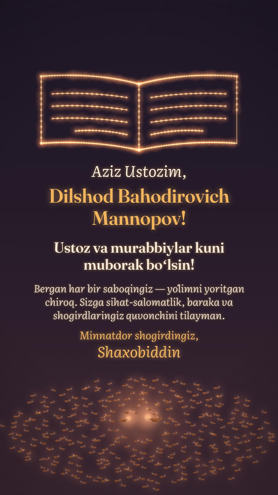

# Bir chiroqdan — ming chiroq

**Ustoz va murabbiylar kuni** munosabati bilan ustoz **Dilshod Bahodirovich
Mannopov**ga shogird tomonidan tabrik. 58 soniyalik vertikal (9:16) film,
Telegram, Instagram va WhatsApp uchun.



- Video: [`out/ustoz-tabrik-final.mp4`](out/ustoz-tabrik-final.mp4) (1080×1920, 24 fps, ovozli)
- Kadrlar varag'i: [`out/ustoz-tabrik-contact.jpg`](out/ustoz-tabrik-contact.jpg)

## Hikoya

Kechasi, stol ustida o'chiq kichik moychiroq va chizib tashlangan urinishlarga
to'la daftar turibdi. Qorong'ida savol belgilari suzib yuribdi. Keyin katta
chiroq keladi. Uning nuri savollarni uchqunga aylantiradi va u o'z olovidan
kichik chiroqni yoqadi. Daftarga ustozning so'zlari yoziladi: *«Qalbingga
quloq sol!»*, shogird esa yoniga belgi qo'yadi. Kichik chiroq
boshqasini yoqadi, u yana boshqasini, va qorong'ilik chiroqlar maydoniga
aylanadi. Har bir olovdan bittadan nur ko'tariladi va osmonda ochiq kitobni
chizadi. Shundan so'ng tabrik chiqadi.

| Vaqt | Ekranda | Izoh (shogird tilidan) |
| --- | --- | --- |
| 0–5 s | Qorong'i stol, o'chiq chiroq, savol belgilari | *Bir paytlar menda faqat savollar bor edi…* |
| 5–10 s | Ustoz chirog'i keladi, savollar uchqunga aylanadi | *Keyin Siz keldingiz.* |
| 10–15 s | Olovlar bir-biriga tegadi, kichik chiroq yonadi | *Va o'z chirog'ingizdan mening chirog'imni yoqdingiz.* |
| 15–25 s | Daftarga «Qalbingga quloq sol!» yoziladi, tagiga chiziladi, shogird belgi qo'yadi | *Siz shunday degan edingiz. Men qalbimga quloq soldim.* |
| 25–35 s | Chiroq chiroqdan yonadi, kamera uzoqlashadi: yuzlab chiroq | *Chiroqdan chiroq yoqilsa, nuri kamaymaydi… …aksincha, olam yorishadi.* |
| 35–41 s | Nurlar ko'tarilib, osmonda ochiq kitobni chizadi | — |
| 41,6–58 s | Tabrik | Aziz Ustozim, Dilshod Bahodirovich Mannopov! Ustoz va murabbiylar kuni muborak bo'lsin! … Minnatdor shogirdingiz |

## Ko'rinish va ovoz

- **Qorong'i qog'ozdagi bo'r va qalam chiziqlari.** Chiroqlar, daftar, stol
  va savol belgilari `drawCel` qalam materialida chizilgan. Chizilgach, chiziq
  qimirlamaydi. Olov va uning nuri filmdagi yagona to'yingan rang. Nur tushgan
  narsa rangga kiradi: loy, qog'oz, siyoh. Film oxirida fon iliq shom rangiga
  o'tadi.
- **Obrazlar, personajlar emas.** Ustoz — katta moychiroq, shogird — kichik
  moychiroq. Olovning lipillashi ataylab qilingan (seed bo'yicha shovqin).
- **Ovoz** to'liq shu faylda Web Audio bilan sintez qilingan. Tayyor namuna
  yoki litsenziyali musiqa ishlatilmagan.
  - Musiqa D-majorda, daqiqasiga 76 zarb. Pianino va musiqa qutisi chaladi.
  - Muqaddima Bm–G–D–A, keyin D–A/C#–Bm–G–D/F#–G–A–D kuy bilan.
  - Olov uzatilganda qo'ng'iroq, chiroqlar ko'payganda jiringlash, nurlar
    ko'tarilganda arfa glissandosi chalinadi.
  - Faqat musiqiy tovushlar ishlatilgan, shovqin yo'q.
  - Balandlik: −16,9 LUFS, eng baland nuqta −1,5 dBFS. Kuchli cheklagich
    ishlatilmagan.

## Fayllar

- [`ustoz-tabrik.html`](ustoz-tabrik.html) — film: brif, vaqtlar (`T`),
  sahna, izohlar (`CAPS`), tabrik matni (`card`, `WISH`) va musiqa (`score`)
- [`fonts.js`](fonts.js) — Fraunces va Literata Italic (SIL OFL 1.1), oflayn
  render uchun ichiga joylangan
- [`tools/score.mjs`](tools/score.mjs) — faqat ovozni render qilish

Tabrik matni `ustoz-tabrik.html` dagi `card()` funksiyasida. Imzo bir qator:
"Minnatdor shogirdingiz".

```bash
cd films/ustoz-tabrik
npm i --no-audit --no-fund
node render.mjs ustoz-tabrik.html --grid 24 --out out     # tezkor ko'rik
node render.mjs ustoz-tabrik.html --out out               # MP4 + ovoz
# ovozni eng baland nuqtasi −1,5 dBFS bo'ladigan qilib ulash
cd out && ffmpeg -y -i ustoz-tabrik.mp4 -i ustoz-tabrik-score.wav -map 0:v:0 -map 1:a:0 \
  -af "volume=7.5dB,alimiter=limit=0.891:attack=5:release=80:level=disabled,apad" -t 58 \
  -c:v copy -c:a aac -b:a 192k ustoz-tabrik-final.mp4
```

## Birlashgan video

Bu film "Qalam" ([`../ustoz-portret/`](../ustoz-portret/)) bilan bitta
videoga ulanadi: avval chiroqlar hikoyasi, keyin portret, oxirida bitta
umumiy tabrik. Buning uchun film `--look merge` bilan render qilinadi:

- film 44 soniyada tugaydi: nurlar kitobni chizgach, kadr "Qalam"ning iliq
  qorong'i rangiga (`#1a1714`) o'tadi, "Qalam" esa aynan shu rangdan ochiladi;
- tabrik kartasi chiqmaydi, u "Qalam"ning oxirida bir marta keladi;
- musiqa G–D akkordlari bilan yumshoq yakunlanadi va kadr bilan birga so'nadi,
  keyin "Qalam"ning G-majordagi kuyi boshlanadi.

Birlashgan videoning ikkinchi yarmi ustozning suratidan chizilgani uchun u
repozitoriyga qo'yilmagan. Ulash buyruqlari:
[`../ustoz-portret/README.md`](../ustoz-portret/README.md#birlashgan-video).

## Tekshiruv va cheklovlar

- MP4 xatosiz dekodlanadi: 1392 kadr, 58,0 s, 1080×1920, ovoz AAC 48 kHz.
- Grid, olov uzatilishi (11,3–11,8 s) va nurlar ko'tarilishining (37,5–38 s)
  ketma-ket kadrlari hamda to'liq o'lchamdagi kadrlar ko'zdan kechirildi.
  Izohlar orqasidagi yumshoq soya matnni chiroqlar ustida ham o'qiladigan
  qiladi.
- Oxirgi 10 soniyada tabrik joyida turadi. Faqat olovlar va nur nuqtalari
  ataylab lipillaydi.
- Bu muhitda videoni odatiy tezlikda ko'rish va ovozni eshitish imkoni
  bo'lmadi.
